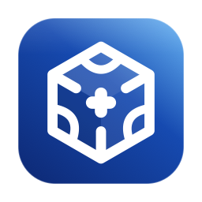

<div align="center">
    
    <h1>Ice++</h1>
    <p>macOS 菜单栏管理。隐藏图标、Ice Bar、中文界面。只提供 Apple 芯片（M 系列）安装包。</p>
</div>

[](https://github.com/itworksig/IcePlusPlus/actions/workflows/release.yml)
[](https://github.com/itworksig/IcePlusPlus/releases/latest)


基于 [Jordan Baird 的 Ice](https://github.com/jordanbaird/Ice)。本仓库是 [itworksig/IcePlusPlus](https://github.com/itworksig/IcePlusPlus)。界面名称是 Ice++，包标识仍是 `com.jordanbaird.Ice`。

## 安装

到 [Releases](https://github.com/itworksig/IcePlusPlus/releases/latest) 下载：

| 文件 | 用途 |
| --- | --- |
| `Ice-arm64.dmg` | 手动安装。打开后把 `Ice.app` 拖进“应用程序”。 |
| `Ice.zip` | 同一个 arm64 应用。应用里的「检查更新」用这个包替换当前副本。 |
| `release.json` | 这次构建的版本号、构建号和芯片架构。 |

系统要求是 macOS 14 或更高，Apple 芯片。安装包没有做公证。第一次打开若被拦截，在终端执行：

```bash
xattr -d com.apple.quarantine /Applications/Ice.app
```

然后在「系统设置 → 隐私与安全性」里打开辅助功能和屏幕录制。

## 检查更新

关于页的「检查更新」不读 Sparkle 的 appcast。它直接看这个仓库的最新 Release。

1. 读取正在运行的应用的 `CFBundleShortVersionString`。
2. 请求 `https://api.github.com/repos/itworksig/IcePlusPlus/releases/latest`。这个接口未登录时全网每小时只有 60 次。返回 403 或 429 时，改看 `https://github.com/itworksig/IcePlusPlus/releases/latest` 跳到的版本标签，并下载 `Ice.zip`。
3. 把 Release 标签 `vX.Y.Z` 和本机版本按数字比较。`v` 前缀和 `-beta` 这类后缀不参与比较。`1.0` 和 `1.0.0` 视为同一版本。
4. 远程版本更高，才算有新版。相等或更低，提示已是最新。仓库还没有任何 Release 时，提示还没有已发布的版本。
5. 选择「安装并重新打开」后，下载 `Ice.zip`（没有 zip 时用 `Ice-arm64.dmg`），确认里面的应用标识是 `com.jordanbaird.Ice`、版本更高、并且是 arm64，然后换掉当前正在运行的这份应用并重新打开。

「自动检查更新」打开时，启动后会查一次，之后大约每 24 小时查一次。没有新版本时不弹窗。「自动下载更新」打开时，发现新版本会先下载，再询问是否安装。不会在你没确认的情况下退出菜单栏。

这台 Mac 上如果有 **Ice Dev** 证书，安装脚本会用它重新签名，已授予的辅助功能可以继续匹配。从 GitHub 直接下载的包是临时签名，第一次换上这份包时，辅助功能可能需要重新打开一次。

## 怎么打出一个新版本

每次推送到 `main`，[Release 工作流](.github/workflows/release.yml) 都会把小版本加一，并发布这个构建。它比较项目里的 `MARKETING_VERSION` 和 GitHub 上最新的 Release，取较高的那个，只把最后一位加一。仓库里现在是 27.0.1、还没有 Release，所以下一次成功的推送会发布 **27.0.2**。再推一次就是 27.0.3。

不需要自己打 `vX.Y.Z` 标签。工作流在 `macos-26` 的 Apple 芯片 runner 上编译，把应用版本设成这个新号，上传 `Ice.zip`、`Ice-arm64.dmg` 和 `release.json`。构建号从 1117 往上加。发布完成后，它把新版本号写回项目。这次写回带有 `[skip ci]`，不会再打包一次。

在 Actions 页手动运行 **Release Apple silicon** 也会再发一个小版本。

这个仓库是 fork，GitHub 默认不会运行它的 Actions。先打开 [Actions](https://github.com/itworksig/IcePlusPlus/actions) 并启用。启用之前的推送不会补跑，启用后再推一次 `main` 才会打出安装包。

## 本地开发

本机没有 Xcode.app 时，用 Command Line Tools 的 MacOSX SDK 编调试版，装到 `/Applications/Ice-Dev.app`，并用 Ice Dev 证书签名，这样不用每次重新授权。步骤见 [script/README.md](script/README.md)。

## 许可

[GPL-3.0](LICENSE)。
